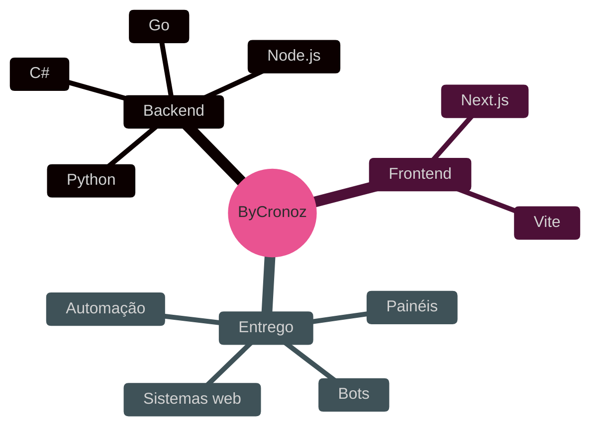
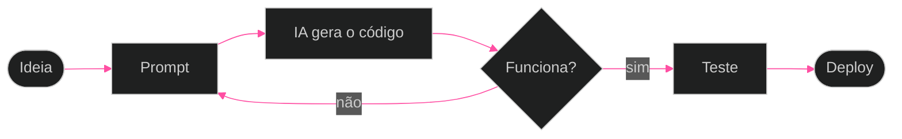

<div align="center">

```text
    ____        ______                          
   / __ )__  __/ ____/________  ____  ____  ____
  / __  / / / / /   / ___/ __ \/ __ \/ __ \/_  /
 / /_/ / /_/ / /___/ /  / /_/ / / / / /_/ / / /_
/_____/\__, /\____/_/   \____/_/ /_/\____/ /___/
      /____/                                    
```

**VIBE CODER**

`Painéis` · `Bots` · `Sistemas web` · `Automação`

</div>

---

## Sobre

```console
$ whoami
ByCronoz

$ cat perfil.txt
vibe coder
atuo na Nythric
construo painéis, bots, sistemas web e automações com IA

$ echo $STACK
C#  Go  Next.js  Vite  Node.js  Python
```

> [!NOTE]
> Sou vibe coder: eu defino o que construir, a IA escreve comigo e eu entrego.

---

## Stack

| Área | Tecnologias |
| :-- | :-- |
| **Backend** | C# · Go · Node.js · Python |
| **Frontend** | Next.js · Vite |
| **Foco** | Painéis · Bots · Sistemas web · Automação |



---

## Como eu trabalho



---

## Organização

<details>
<summary><b>Nythric</b></summary>

<br/>

Projetos que desenvolvo na [Nythric](https://github.com/nythric).

</details>

---

## Contato

| | |
| :-- | :-- |
| **GitHub** | [@ByCronoz](https://github.com/ByCronoz) |
| **Organização** | [Nythric](https://github.com/nythric) |
| **Discord** | `seu_usuario` |
